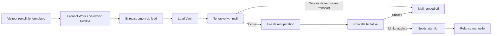

<div align="center">
  <h1>Leadealer</h1>
  <p><strong>Un constructeur de formulaires WordPress pensé pour ne pas perdre un prospect parce qu’un e-mail n’est jamais arrivé.</strong></p>
  <p>
    
    
    
    <a href="LICENSE"></a>
  </p>
  <p><strong>Form Builder · Lead Vault · reprise des e-mails · pièces jointes · logique conditionnelle · anti-spam Proof of Work</strong></p>
</div>

---

## Sommaire

- [Pourquoi Leadealer existe](#pourquoi-leadealer-existe)
- [Ce que Leadealer apporte à une entreprise](#ce-que-leadealer-apporte-à-une-entreprise)
- [Comment fonctionne la fiabilité des leads](#comment-fonctionne-la-fiabilité-des-leads)
- [Le Form Builder](#le-form-builder)
- [Installation](#installation)
- [E-mail et SMTP](#e-mail-et-smtp)
- [Sécurité](#sécurité)
- [Confidentialité](#confidentialité)
- [Architecture pour les développeurs](#architecture-pour-les-développeurs)
- [Version et stabilité](#version-et-stabilité)
- [Développement et contributions](#développement-et-contributions)
- [Licence](#licence)


## Pourquoi Leadealer existe

Un formulaire de contact peut fonctionner parfaitement côté visiteur et pourtant perdre sa valeur au dernier moment.

L'utilisateur clique sur **Envoyer**, WordPress tente d'expédier un e-mail, puis un problème SMTP, un serveur de messagerie indisponible, un filtre antispam ou une configuration défaillante empêche le message d'arriver. Dans beaucoup de formulaires, l'e-mail devient alors la seule trace du prospect.

**Leadealer inverse cette logique.**

Lorsqu'une soumission est valide, le lead est d'abord enregistré dans **Lead Vault**. La livraison de l'e-mail vient ensuite et possède son propre état, son historique et ses mécanismes de reprise.

> L'e-mail est un canal de livraison. Il n'est pas la base de données du prospect.

Cette approche est particulièrement utile pour les entreprises qui utilisent leur site WordPress pour recevoir des demandes de devis, des demandes de rappel, des prises de contact ou des demandes accompagnées de photos.

## Ce que Leadealer apporte à une entreprise

### Un filet de sécurité pour les demandes entrantes

Lead Vault conserve les demandes acceptées avant la tentative d'envoi de l'e-mail. En cas de problème de messagerie, le prospect n'est donc pas automatiquement perdu.

Chaque lead peut conserver une **copie figée de la notification**, avec notamment :

- le destinataire ;
- le Reply-To ;
- le sujet ;
- le contenu HTML de l'e-mail ;
- les données envoyées par le visiteur ;
- les photos associées ;
- l'état de livraison ;
- le nombre de tentatives ;
- la chronologie des événements de livraison.

### Un Lead Vault qui se consulte comme une boîte de réception

Le tableau de bord distingue notamment les leads :

- sécurisés dans le Vault ;
- remis à `wp_mail()` ;
- en cours de récupération ;
- nécessitant une intervention ;
- récupérés après plusieurs tentatives.

L'objectif est simple : **pouvoir retrouver la demande même lorsque la boîte mail ne raconte pas toute l'histoire**.

### Des relances automatiques lorsque l'e-mail échoue

Leadealer sépare l'acceptation du lead de sa livraison par e-mail.

Une notification en échec peut être reprise automatiquement jusqu'à **6 tentatives bornées**, avec temporisation progressive, reprise des traitements interrompus et possibilité de relance manuelle depuis l'administration.

Un worker de récupération vérifie également les livraisons en attente ou bloquées toutes les quinze minutes via WP-Cron.

### Des formulaires visuels sans sacrifier la validation serveur

Le constructeur permet de créer et réorganiser les champs visuellement tout en conservant une validation côté serveur fondée sur le schéma publié du formulaire.

Champs disponibles :

- texte ;
- e-mail ;
- téléphone ;
- texte long ;
- nombre ;
- URL ;
- liste déroulante ;
- boutons radio ;
- case à cocher ;
- consentement ;
- ajout de photo.

Le builder inclut également les largeurs responsive pour ordinateur, tablette et mobile, la duplication de champs, l'annulation/rétablissement et la logique conditionnelle.

### Des photos rattachées au lead, pas seulement au mail

Depuis Leadealer 0.7.3, une photo préparée est envoyée **dans la même requête multipart que le lead**. Le navigateur n'a plus besoin d'effectuer un pré-upload séparé puis de transmettre un token caché lors d'une seconde requête.

Le serveur accepte uniquement les formats qu'il sait vérifier et réencoder en sécurité :

- JPEG ;
- PNG ;
- WebP.

Les images acceptées sont décodées puis réencodées côté serveur avant stockage. Le fichier original n'est pas conservé tel quel, ce qui permet notamment de supprimer les métadonnées EXIF/GPS.

HEIC/HEIF n'est jamais décodé côté serveur. Lorsqu'un navigateur sait le décoder nativement, Leadealer peut le convertir en JPEG avant l'envoi. Sinon, le visiteur doit sélectionner un format pris en charge.

Une photo attendue mais absente ou devenue invalide ne doit pas être silencieusement ignorée lors de l'envoi de la notification.

## Comment fonctionne la fiabilité des leads



Le succès renvoyé au visiteur signifie que **sa demande a été acceptée et enregistrée**, pas que le message se trouve déjà dans la boîte de réception finale.

C'est une distinction importante : `wp_mail()` peut indiquer qu'un transport a accepté le message sans pouvoir garantir sa remise finale dans la boîte du destinataire.

## Le Form Builder

Leadealer fournit un constructeur visuel en trois zones avec :

- bibliothèque de champs ;
- canvas de formulaire ;
- paramètres contextuels ;
- insertion par glisser-déposer ;
- réorganisation à la souris, au tactile et au clavier ;
- grille responsive sur 12 colonnes ;
- aperçu ordinateur, tablette et mobile ;
- undo / redo ;
- modèles de départ ;
- logique conditionnelle `all` / `any` ;
- valeurs internes stables pour les choix.

Les libellés visibles d'un choix peuvent ainsi évoluer sans casser automatiquement une condition qui dépend de sa valeur interne.

## Logique conditionnelle

Un champ peut être affiché seulement lorsque certaines conditions sont remplies.

Opérations prises en charge par le builder :

- égal à ;
- différent de ;
- vide ;
- non vide ;
- contient ;
- ne contient pas ;
- coché ;
- non coché.

Les champs masqués par la logique conditionnelle sont également traités côté serveur afin que le navigateur ne soit pas la seule source de confiance.

## Intégration dans WordPress

### Bloc Gutenberg

Leadealer fournit un bloc dynamique **Leadealer Form** pour insérer un formulaire depuis l'éditeur de blocs.

### Shortcode

```text
[leadealer_form id="123"]
```

Remplacez `123` par l'identifiant du formulaire à afficher.

## Installation

1. Téléchargez l'archive de Leadealer.
2. Dans WordPress, ouvrez **Extensions > Ajouter une extension > Téléverser une extension**.
3. Sélectionnez le fichier ZIP puis activez Leadealer.
4. Ouvrez **Leadealer > Forms** et créez un formulaire.
5. Ajoutez vos champs ou partez d'un modèle.
6. Configurez la notification e-mail.
7. Publiez le formulaire.
8. Insérez-le avec le bloc Leadealer ou le shortcode.
9. Consultez **Lead Vault** pour suivre les demandes et leur livraison.

## Prérequis

| Composant | Version |
|---|---:|
| WordPress | 6.6 ou supérieur |
| PHP | 7.4 ou supérieur |
| Version testée déclarée | WordPress 7.0 |

Pour les reprises automatiques de livraison, WP-Cron doit pouvoir fonctionner.

Si `DISABLE_WP_CRON` est activé, configurez un cron système qui appelle régulièrement `wp-cron.php`.

## E-mail et SMTP

Leadealer utilise l'API native :

```php
wp_mail()
```

Cette approche laisse les plugins de livraison SMTP compatibles avec `wp_mail()` prendre en charge le transport du message.

Leadealer suit toutefois **la remise au transport WordPress**, pas la livraison finale dans la boîte de réception distante. Un serveur SMTP peut accepter un message qui sera ensuite retardé, filtré ou rejeté plus loin dans la chaîne.

C'est précisément pour cette raison que Lead Vault reste indépendant de l'e-mail.

## Sécurité

Leadealer est conçu autour d'une règle simple : **le JavaScript du navigateur n'est jamais considéré comme une autorité de sécurité**.

Parmi les mécanismes présents :

- validation et normalisation côté serveur selon le schéma publié ;
- rejet des clés de champs inattendues ;
- Proof of Work signé par HMAC ;
- protection contre la réutilisation de challenges ;
- limitation de débit ;
- honeypot ;
- identifiants de soumission idempotents ;
- secret d'idempotence détenu par le navigateur pour les reprises après perte de réponse ;
- contrôles de capacités WordPress sur les interfaces d'administration ;
- nonces sur les actions administratives sensibles ;
- requêtes SQL préparées pour les données variables ;
- validation stricte des pièces jointes ;
- noms de fichiers générés côté serveur ;
- stockage des images dans un répertoire dérivé d'un secret ;
- vérification d'intégrité avant consultation ou envoi ;
- affichage des pièces jointes réservé aux administrateurs autorisés ;
- absence de décodeur HEIC/WASM tiers embarqué ;
- aucune ressource JavaScript, CSS ou police chargée depuis un CDN au runtime ;
- aucune télémétrie externe intégrée par Leadealer.

Aucun logiciel ne peut être présenté comme exempt de vulnérabilités. Si vous découvrez un problème de sécurité, évitez de publier immédiatement les détails exploitables dans une issue publique. Utilisez de préférence un canal privé via [Assistouest](https://assistouest.fr/).

## Anti-spam Proof of Work

Leadealer utilise un challenge Proof of Work court et signé pour augmenter le coût des soumissions automatisées sans placer un nonce WordPress par visiteur directement dans le HTML mis en cache.

Cela permet de conserver un formulaire compatible avec les systèmes de cache tout en ajoutant une barrière anti-abus côté soumission.

Le niveau de difficulté est configurable dans les réglages de Leadealer. La valeur par défaut recommandée par le plugin est **17**.

Le Proof of Work et le rate limiting sont des mécanismes anti-abus. Ils ne remplacent pas une protection réseau ou applicative contre une attaque DDoS.

## Confidentialité

Leadealer intègre les mécanismes WordPress de confidentialité pour l'export et l'effacement des données personnelles.

Le plugin peut notamment conserver dans Lead Vault :

- les champs soumis ;
- la copie figée de la notification ;
- les pièces jointes ;
- l'identifiant du formulaire ;
- un identifiant aléatoire de soumission ;
- l'état de livraison ;
- les événements de la chronologie de livraison ;
- les horodatages nécessaires au fonctionnement et à la récupération.

Leadealer ne stocke pas l'adresse IP brute pour son mécanisme anti-abus. Un identifiant réseau temporaire dérivé par HMAC est utilisé à la place.

La durée de conservation des leads remis peut être configurée dans **Leadealer > Settings**. Une valeur de `0` signifie une conservation sans limite de durée configurée. Les livraisons non résolues ne sont pas supprimées simplement parce que la durée de rétention est dépassée.

Les champs de consentement peuvent également intégrer automatiquement un lien vers la page de politique de confidentialité configurée dans WordPress.

## Lead Vault et états de livraison

| État | Signification |
|---|---|
| **Leads secured** | Le lead a été enregistré avant la livraison du mail |
| **Mail handed off** | `wp_mail()` a accepté la notification pour son transport |
| **Recovering** | La notification est en attente ou en cours de nouvelle tentative |
| **Needs attention** | Les tentatives automatiques sont épuisées ou une intervention est nécessaire |
| **Recovered** | La notification a finalement été remise après plusieurs tentatives |

Une relance manuelle peut démarrer un nouveau cycle de livraison lorsqu'une intervention humaine est nécessaire.

## Pièces jointes et photos

Le traitement des photos suit plusieurs étapes avant qu'un fichier soit considéré comme utilisable :

1. préparation côté navigateur ;
2. envoi multipart avec la soumission ;
3. vérification de l'erreur d'upload PHP ;
4. contrôle de la taille réelle ;
5. détection du type MIME ;
6. vérification de la signature et des dimensions ;
7. limites sur les dimensions et le nombre total de pixels ;
8. décodage complet ;
9. réencodage ;
10. génération d'un nom aléatoire côté serveur ;
11. association au lead ;
12. nouvelle vérification avant consultation ou envoi par e-mail.

Leadealer n'expose pas volontairement une URL publique générée par le plugin pour consulter ces fichiers. Leur consultation depuis Lead Vault passe par une action administrateur protégée.

## Internationalisation

Le code source utilise l'anglais US pour les chaînes traduisibles et le plugin embarque actuellement une traduction française.

Le domaine de traduction est :

```text
leadealer
```

Les fichiers POT, PO, MO et le catalogue PHP de traduction sont inclus dans le paquet distribué.

## Architecture pour les développeurs

Le code est volontairement séparé par responsabilités principales :

```text
leadealer/
├── assets/
│   ├── css/
│   └── js/
├── includes/
│   ├── class-leadealer-admin.php
│   ├── class-leadealer-database.php
│   ├── class-leadealer-entry-repository.php
│   ├── class-leadealer-form-repository.php
│   ├── class-leadealer-image-processor.php
│   ├── class-leadealer-mail-template.php
│   ├── class-leadealer-mailer.php
│   ├── class-leadealer-plugin.php
│   ├── class-leadealer-privacy.php
│   ├── class-leadealer-renderer.php
│   ├── class-leadealer-rest-controller.php
│   ├── class-leadealer-security.php
│   ├── class-leadealer-templates.php
│   └── class-leadealer-upload-repository.php
├── languages/
├── LICENSE
├── leadealer.php
├── readme.txt
└── uninstall.php
```

### Endpoints REST publics

Leadealer utilise notamment les routes suivantes :

```text
POST /wp-json/leadealer/v1/challenge
POST /wp-json/leadealer/v1/submit/{form_id}
POST /wp-json/leadealer/v1/upload/{form_id}
```

La route `/upload/{form_id}` reste présente pour la compatibilité avec d'anciens scripts front-end mis en cache. Le front-end 0.7.3 envoie les photos avec la soumission multipart et n'en dépend plus pour le flux normal.

Ces routes sont publiques par nature puisqu'un visiteur non authentifié doit pouvoir envoyer un formulaire. L'autorisation ne repose donc pas sur un compte WordPress, mais les callbacks appliquent les contrôles de schéma, Proof of Work, anti-rejeu, limites de taille et autres validations prévues pour les soumissions publiques.

## Cycle de livraison

Pour chaque lead accepté, Leadealer fige les informations nécessaires à la notification afin qu'un changement ultérieur du formulaire ne modifie pas silencieusement un e-mail déjà en attente.

Le système utilise notamment :

- un état de livraison persistant ;
- une prise de verrou atomique avant traitement ;
- un nombre maximal de tentatives ;
- des événements WP-Cron individuels ;
- un worker de récupération redondant ;
- un watchdog pour les traitements devenus obsolètes ;
- un état de type dead-letter lorsque l'automatisation ne peut plus résoudre le problème seule.

## Multisite

Le cycle d'activation prend en charge WordPress Multisite. Lors d'une activation réseau, Leadealer initialise les sites existants et prévoit également l'initialisation des nouveaux sites créés tant que le plugin reste activé sur le réseau.

## Désinstallation

Le réglage **Delete data on uninstall** permet de choisir si la suppression du plugin doit également supprimer ses données.

Lorsque cette option est activée, la désinstallation peut supprimer les formulaires, entrées Lead Vault, historiques de livraison, tables de sécurité, fichiers gérés par Leadealer et options du plugin.

Ne cochez cette option que si cette suppression est réellement souhaitée.

## Version et stabilité

Version documentée : **0.7.3**.

Leadealer est encore dans une série `0.x`. Le plugin est utilisable, mais son architecture, son schéma de données ou certaines interfaces peuvent encore évoluer avant une version 1.0.

Pour un usage professionnel, testez toute mise à jour sur un environnement de préproduction et conservez une sauvegarde WordPress complète avant déploiement.

## Développement et contributions

Les contributions sont les bienvenues lorsqu'elles restent cohérentes avec les objectifs du projet :

- fiabilité des leads ;
- sécurité par défaut ;
- comportement WordPress natif ;
- accessibilité ;
- absence de dépendances runtime inutiles ;
- compatibilité avec le cache ;
- expérience claire pour les utilisateurs non techniques.

Pour proposer une modification :

1. créez une branche dédiée ;
2. limitez le changement à un objectif clair ;
3. documentez le comportement avant/après ;
4. ajoutez ou adaptez les tests lorsque cela est pertinent ;
5. vérifiez la compatibilité PHP et WordPress annoncée ;
6. ouvrez une Pull Request avec les risques et cas limites identifiés.

Les signalements de sécurité exploitables doivent être transmis en privé plutôt que dans une issue publique.

## Philosophie du projet

Leadealer n'essaie pas de transformer un formulaire de contact en CRM complet.

Son objectif est plus précis :

> **Créer des formulaires WordPress agréables à utiliser tout en donnant à chaque lead accepté une chance de survivre à un problème d'e-mail.**

La priorité est donc donnée à la conservation, à la traçabilité, à la reprise et à une validation serveur stricte plutôt qu'à l'accumulation de fonctionnalités marketing.

## Auteur

Leadealer est développé par **Adrien Piron**.

Site : [assistouest.fr](https://assistouest.fr/)

## Licence

Leadealer est distribué sous licence **GPL-2.0-or-later**.

Consultez le fichier [LICENSE](LICENSE) pour le texte complet de la licence.
